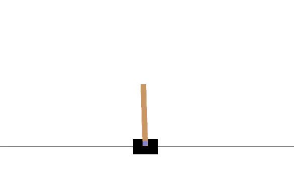

# Deep Q-Network (DQN) on CartPole-v1

This project implements a Deep Q-Learning (DQN) agent using PyTorch to solve the classic `CartPole-v1` environment from OpenAI Gymnasium. The agent learns to balance a pole on a moving cart through reinforcement learning, with support for video recording and training visualization.

---

## Features

- **DQN agent** with experience replay and target network
- **Epsilon-greedy exploration** strategy
- **Soft target updates** for training stability
- **Video recording** of every Nth episode (customizable)

---
## Demo


## Dependencies

Install:

```bash
pip install torch gymnasium 